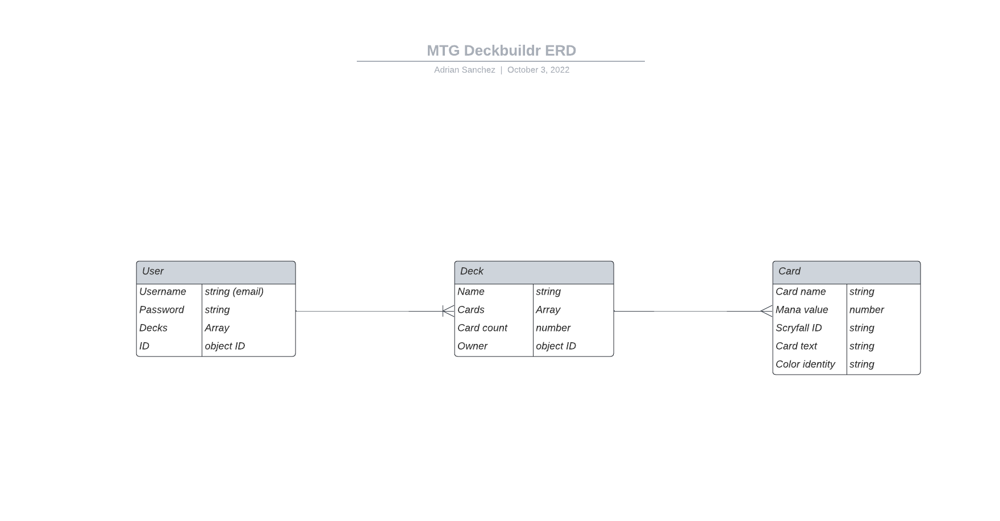
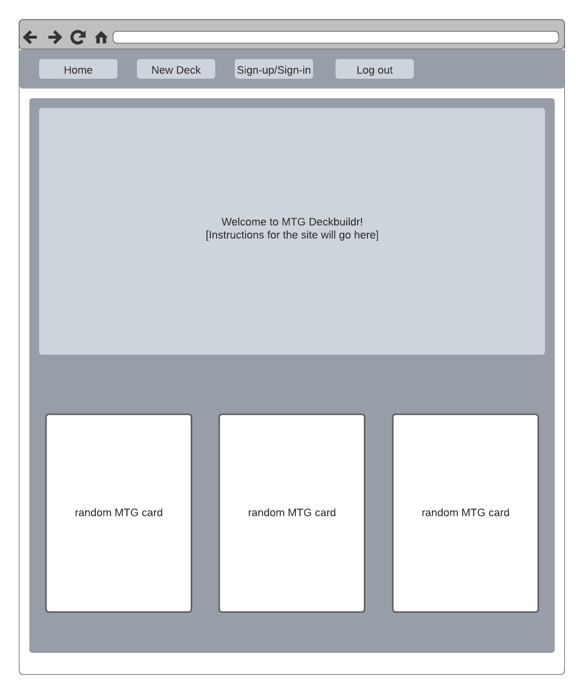
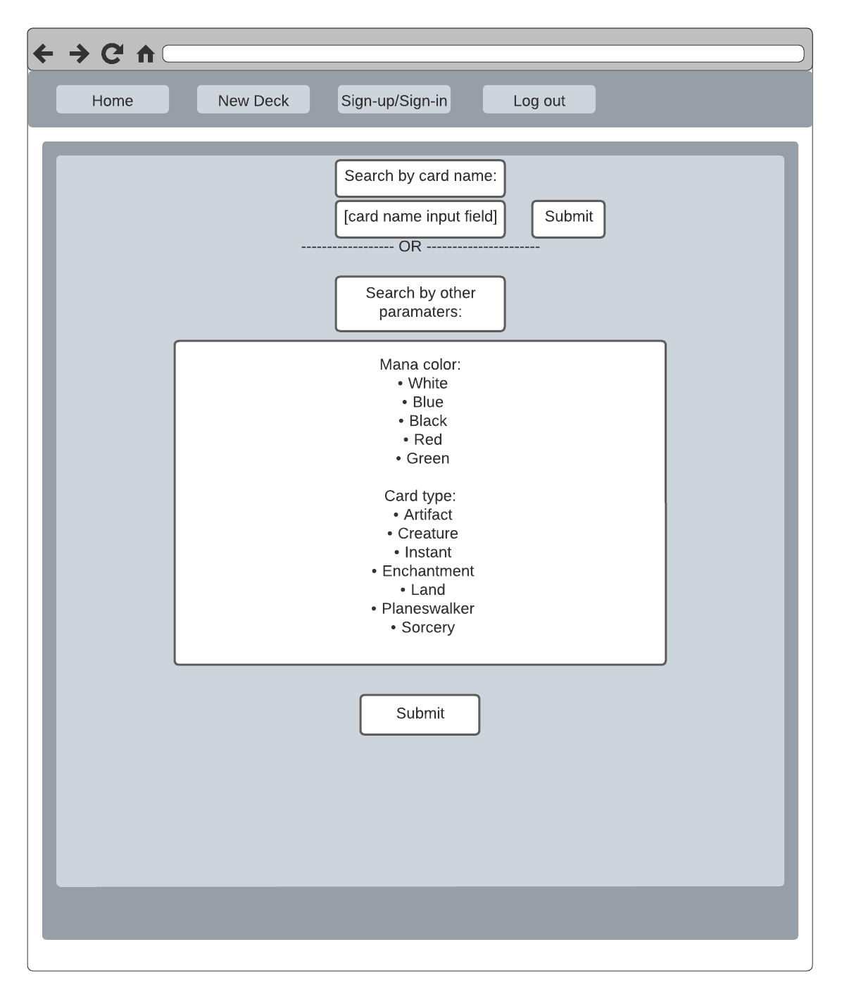
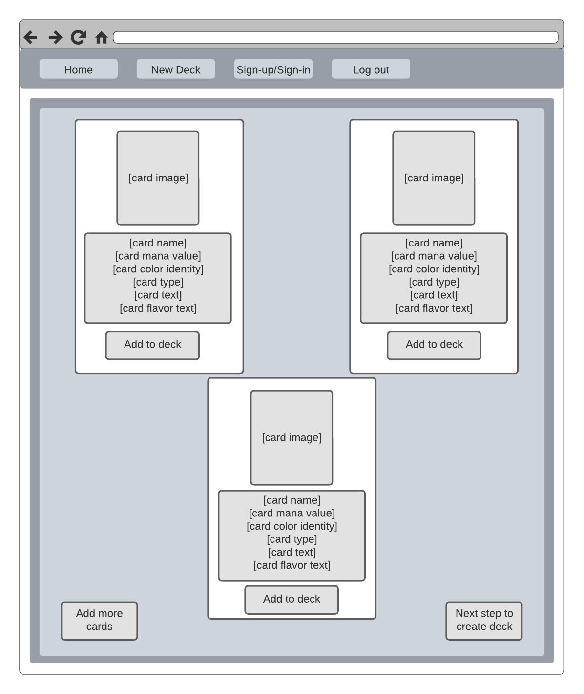
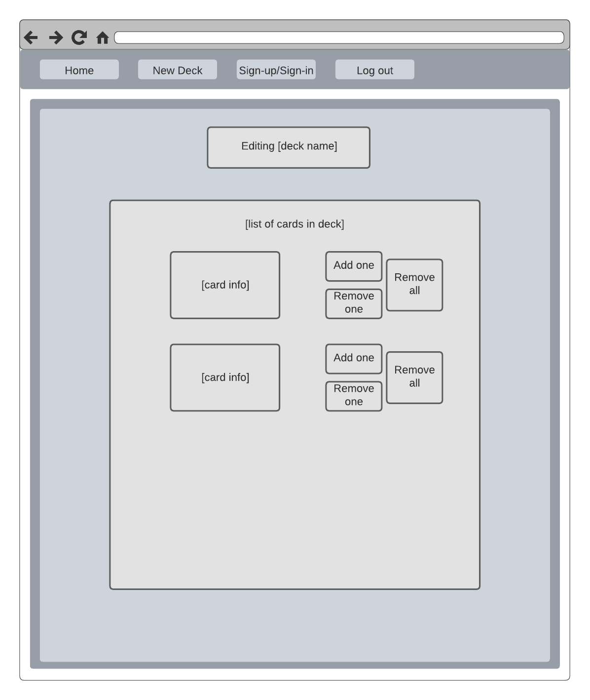

<h1>
:hammer: MAGIC: THE GATHERING DECKBUILDR :hammer:
</h1>

<h3>(Link to deployed app coming soon!)</h3>

<h5>Adrian Sanchez</h5>

<h1>:pencil: Description</h1>

    MTG Deckbuildr is an app built to let users quickly build decks 
    for Magic: The Gathering's Standard format. With the app, users 
    can search for cards either by card name, or by searching for 
    cards with various paramaters, such as mana color or card type. 
    This app aims to streamlined enough that users who know what 
    they want to build can easily search up the cards they need and 
    build a deck, without worrying about other information such 
    metagame standing, or buying options.

<h1>:camera: Screenshots</h1>

  
:bar_chart: ERD

  | Description | Screenshot | 
  |:------------:|-----------| 
  | <h3>ERD</h3> |  

  
:art: Wireframes

  |    Description    | Screenshot | 
  |:-----------------:|-------------| 
  | <h3>Home Page</h3>|  
  | <h3>Card Search</h3> |  
  | <h3>Card Results</h3> |  
  | <h3>Deck Edit</h3> |  

